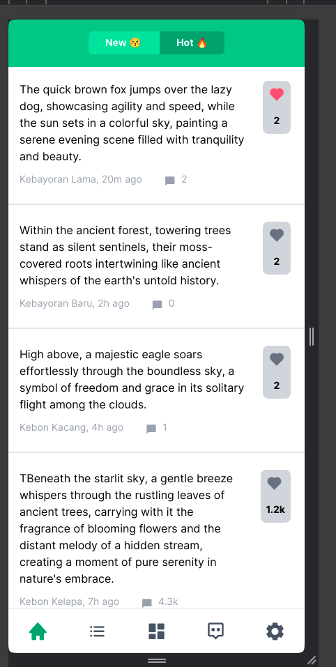

# Secret Fox Anonymous UI Inspired Project

This project is inspired by the sleek and modern user interface of the Secret Fox Anonymous app.

## Description

This project aims to recreate the aesthetic and user experience of the Secret Fox Anonymous app using Tailwind CSS for styling.

## Features

- Responsive design
- Clean and minimalist UI
- Seamless user interaction

## Technologies Used

- HTML
- CSS
- Tailwind CSS

## Getting Started

- Clone the repository.
- Open the project in your code editor.
- Customize and modify the UI to suit your needs.
- Run the project locally to see the changes.

## Preview

## Contributors

Hudya Ramadhana

Feel free to contribute and enhance this project further!
